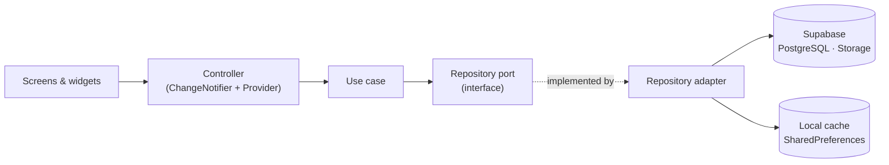

<p align="center">
  
</p>

<p align="center">
  <b>Collaborative micro-learning mobile app built with Flutter and Supabase.</b><br>
  Create courses, learn through short lessons, practice with graded exercises and keep your streak going.
</p>

<p align="center">
  
  
  
  
  
  
</p>

---

## Features

| | |
| --- | --- |
| 🔐 **Accounts** | Sign up and login with hashed passwords, password recovery by email, profile editing, followers |
| 📚 **Courses & lessons** | Create and edit courses; lessons split into chapters with video, PDF and rich-text content |
| 🧩 **Exercises** | Ordering, fill-in-the-blank, short answer and theory questions, with automatic grading and results |
| 💬 **Community** | Discussion forums with nested replies and likes, course ratings and content reports |
| 🔥 **Progress** | Learning progress, daily streaks, saved items and notifications |
| 🔎 **Discovery** | Search with filters, onboarding flow and an in-app assistant chatbot |
| 🛠️ **Admin** | Moderation panel for users, lessons and reported content |

## Architecture

Book-L follows **hexagonal architecture (ports and adapters) organized by feature**: 17 isolated modules under `lib/features/`, each with the same three layers and dependencies pointing inward.



```
lib/
├── core/        # router, theme, global state, Supabase client, error handling
├── shared/      # reusable widgets (video player, rich-text editor, filters, modals)
└── features/
    └── <feature>/
        ├── domain/          # pure Dart models, no Flutter imports
        ├── application/     # use cases + output ports
        └── infrastructure/
            ├── adapters/in/   # screens, widgets, controllers
            └── adapters/out/  # repository implementations, DTOs
```

- **Remote data, local fallback:** repositories work against Supabase and fall back to a local JSON snapshot in SharedPreferences when the backend is unreachable.
- **Predictable state:** controllers expose state through `ChangeNotifier`; the UI rebuilds with Provider and `ListenableBuilder`.
- Design notes, use cases and class diagrams: [`ARQUITECTURA_BOOKL.md`](book_l/ARQUITECTURA_BOOKL.md), [`casosdeuso.json`](book_l/casosdeuso.json), [`diagramaclases.json`](book_l/diagramaclases.json) (Spanish).

## Tech stack

- **App:** Flutter · Dart · Provider · flutter_quill · video_player · flutter_pdfview · image_picker / file_picker
- **Backend:** Supabase (PostgreSQL, Storage) · password hashing with `crypto` · email recovery
- **Quality:** flutter_lints · unit and database tests in `book_l/test/`

## Getting started

```bash
git clone https://github.com/LeoBarraza0/Book-L.git
cd Book-L/book_l
flutter pub get
flutter run            # choose an Android/iOS emulator or Chrome
flutter test
```

The database schema is in [`book-l_supabase.sql`](book_l/book-l_supabase.sql). To use your own Supabase project, run it there and update the URL and anon key in `lib/core/infrastructure/services/supabase_client.dart`. Without a reachable backend the app runs on the sample data in `assets/data/`.

## Team

Built by **[Leonardo Barraza](https://github.com/LeoBarraza0)** and **Freddy Rangel**.
